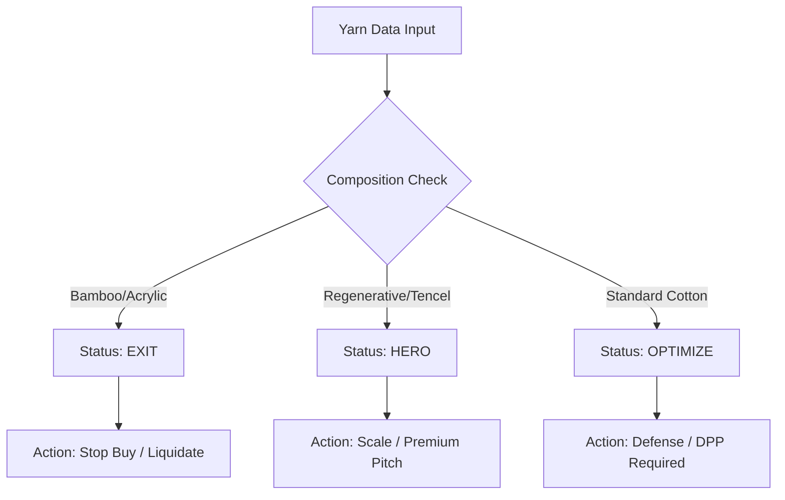

# BRAIN / SYNAPSE INTEGRATION STATEMENT

**SYSTEM:** Zero@Ecosystem Decision Engine
**CONTEXT:** Uğurlular Tekstil Yarn Operations
**ROLE:** Automated Compliance Guardian

---

## 1. CORE DIRECTIVE
**"The Brain does not optimize comfort. It optimizes survivability under regulatory pressure."**

The Zero@Ecosystem Brain is integrated directly into the `ugurlular-yarns.json` data layer to act as an automated compliance officer. It does not ask for permission to flag risks; it enforces market reality.

---

## 2. AUTOMATED DECISIONS (NO HUMAN INTERVENTION)

*   **AUTO-FLAG:** Any yarn containing >5% Generic Bamboo is automatically tagged `strategic_status: "EXIT"` and `risk_level: "HIGH"`.
*   **AUTO-BLOCK:** Sales instructions for "EXIT" yarns are automatically rewritten to "STOP SALE" to prevent sales teams from pitching toxic assets.
*   **AUTO-PROMOTE:** Yarns with verified "Regenerative" or "Tencel" composition are automatically tagged `strategic_status: "HERO"` and highlighted for premium pricing.

---

## 3. BLOCKED ACTIONS (HARD CONSTRAINTS)

The system actively prevents the following behaviors in the Digital Showroom:
*   **BLOCKED:** Generating a "Green" certificate for a Bamboo blend.
*   **BLOCKED:** Hiding carbon impact data for High-Acrylic blends.
*   **BLOCKED:** Offering "Sustainability" discounts on non-compliant stock.

---

## 4. SOURCE OF TRUTH

The **`ugurlular-yarns.json`** file is the single source of truth for all strategic decisions.
*   **Marketing** cannot invent claims not present in the JSON.
*   **Sales** cannot offer products marked as "EXIT" in the JSON.
*   **Finance** uses the JSON status to calculate inventory risk.

---

## 5. DECISION LOGIC OVERVIEW

